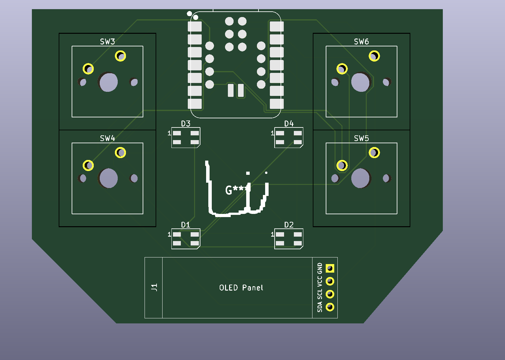

# My Dev Board
## Hour 20:58
Im going to start the board.
Ok so im going to start adding the pins for the Pico.
# Day one finished (i got lazy)
# Day Two
## Hour 10:05
Ok im going to use the XIAO RP2350 and a screen.
## Hour 10:26
Added the screen! going to add the switches.

## Hour 11:52
Ok i added the Switches and screen.
## Hour 12:11
I finished the pcb part! Now i need to do the wireing.

## Hour 13:41
Finished all the PCB!!!!
In one day!!!

