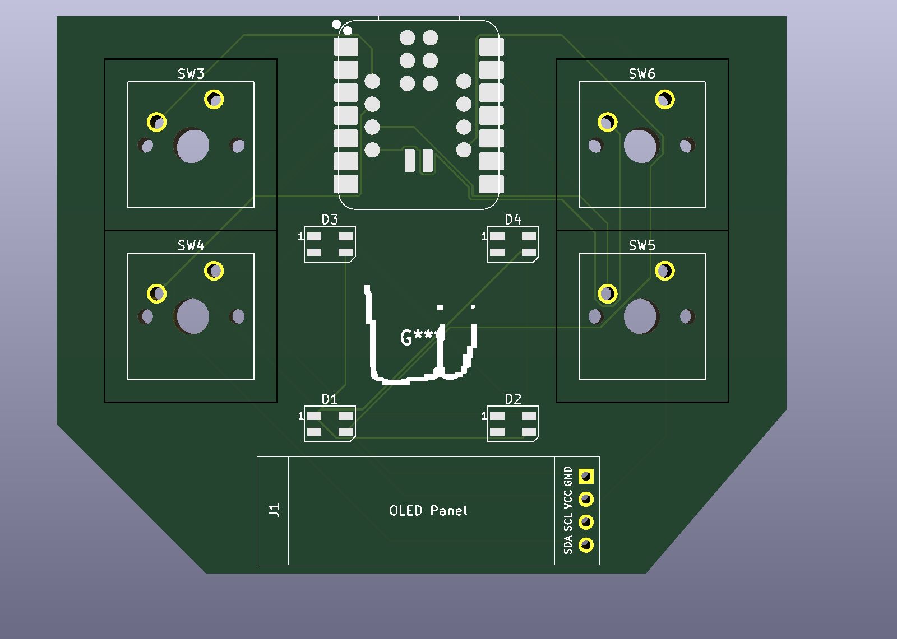

# Lucas11-Dev-Board

## An fast Dev Board for the XIAO RP2350 for prototyping and just making projects without soldering every time.
## But how it works?
Its a board with MX switches, OLED screen, MINI-E leds, and all-in-one using the power of the XIAO RP2350.
## How to use?
First install the SSD1406 module with this
```
cd example_firmware
cd lib
mpremote mip install ./ssd1306.py
```
Then use the example_firmware to start programing in the board.